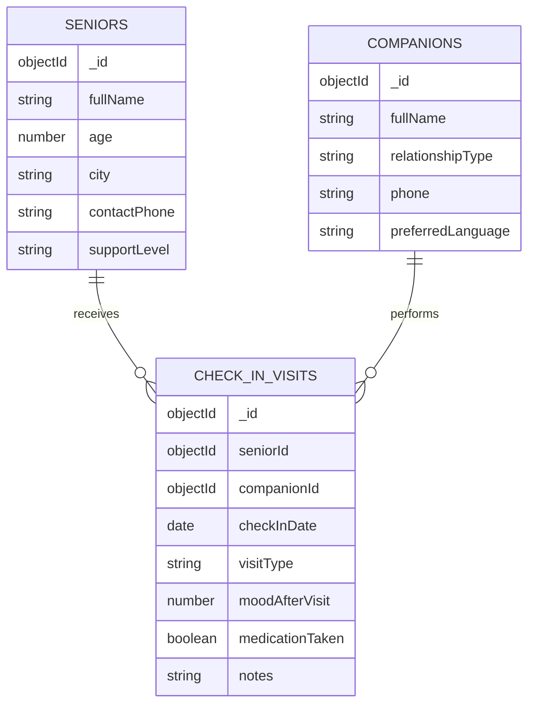

# ERD (DA219B)

## Validation Targets
- `Senior.supportLevel`: enum `low`, `medium`, `high`.
- `Companion.relationshipType`: enum `family`, `volunteer`, `caregiver`, `neighbor`.
- `CheckInVisit.visitType`: enum `call`, `home_visit`, `video_call`.
- `CheckInVisit.moodAfterVisit`: number between `1` and `5`.
- `CheckInVisit.medicationTaken`: required boolean (custom field).
- `CheckInVisit.checkInDate`: required and cannot be in the future.
