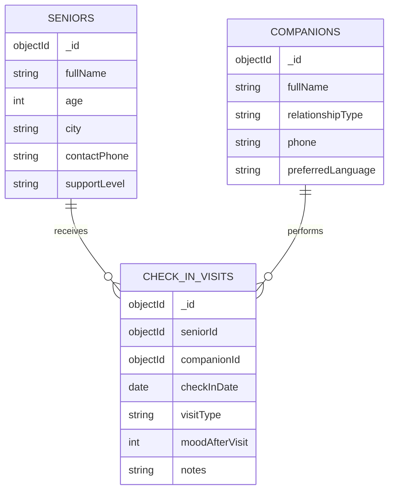

# Day 1 ERD Draft (DA219B)

## Validation targets (to implement in Day 2)
- `CheckInVisit.moodAfterVisit`: required, number, min 1, max 5.
- `CheckInVisit.visitType`: required enum (`call`, `home_visit`, `video_call`).
- `Senior.supportLevel`: required enum (`low`, `medium`, `high`).
- `Companion.relationshipType`: required enum (for example `family`, `volunteer`, `caregiver`).
