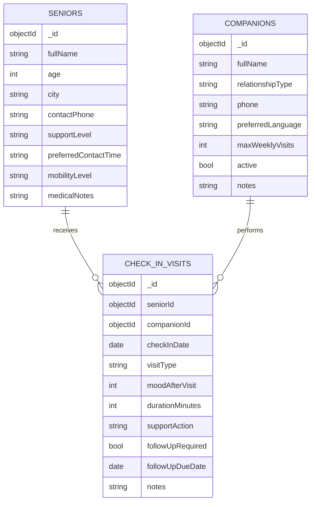

# Day 2 ERD (DA219B)

## Validation targets implemented
- `Senior`: required `fullName/age/city/contactPhone/supportLevel/preferredContactTime/mobilityLevel`, age range 60-110, unique phone, enum rules.
- `Companion`: required identity/contact fields, enum rules, unique phone, `maxWeeklyVisits` range 1-14.
- `CheckInVisit`: required object references, enum rules, `moodAfterVisit` range 1-5, `durationMinutes` range 5-240, no future `checkInDate`, conditional `followUpDueDate`.

## Seed requirements implemented
- 6 realistic seniors
- 6 realistic companions
- 6 realistic check-in visits linked by ObjectId references
